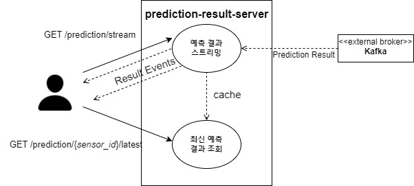

# prediction-result-sse-server
## 주요 기능
- 예측 결과 이벤트를 두 가지 방식으로 전달합니다.
- Server-Sent Events로 예측 결과 스트림을 전달합니다.
- 가장 최근 예측 결과 캐시를 동기적으로 전달합니다.
<div align="center">
  
</div>

## API 명세
### GET /prediction/stream
Server-Sent Events로 예측 결과 스트림을 전달합니다.<br>

- Response Stream (text/event-stream)<br>
<i>Note:</i> 스트림 데이터는 json직렬화된 바이트입니다.
```
// text/event-stream; charset=utf-8
Id: 
Type: message
Data: b'{"x": {"variables": [{"id": "", "values": [...]}], "timestamps": [...]}, "y_hat": {"variables": [{"id": "", "values": [...]}], "timestamps": [...]}}'
Time: 
```
### GET /prediction/{sensor_id}/latest
가장 최근 예측 결과 캐시를 동기적으로 전달합니다.
- Response 200
```json
{
  "x": {
    "timestamps": [
      ...
    ],
    "variables": [
      {
        "id": "",
        "values": [
          ...
        ]
      }
    ]
  },
  "y_hat": {
    "timestamps": [
      ...
    ],
    "variables": [
      {
        "id": "",
        "values": [
          ...
        ]
      }
    ]
  }
}
```
- Response 404 (No cache or Sensor Not Found)
## 실행
### 환경변수
##### required
- ```KAFKA_BOOTSTRAP_SERVER```: 카프카 브로커 주소
- ```PREDICTION_RESULT_TOPIC```: 예측 결과 토픽 이름
##### optional
- ```ADVERTISED_HOST```: 외부 노출 서버 주소, default: "0.0.0.0"
- ```PORT```: 외부 노출 서버 포트, default: "5000"

### Docker Container로 실행하는 경우
- 이미지 가져오기
```shell
$ docker pull youngminan/prediction-sse-server
```
- (optional) nightly build
```shell
$ docker build -t {IMAGE TAG} .
```

- run<br>
```shell
$ docker run -d --network=host --restart=always -v {CONTEXT_CACHE_VOLUME}:/var/cache/context -e KAFKA_BOOTSTRAP_SERVER="{KAFKA_BROKER}" -e PREDICTION_RESULT_TOPIC={PREDICTION_RESULT_TOPIC_NAME}  youngminan/prediction-sse-server
```


### Python3.8 인터프리터로 실행하는 경우
```shell
...  ...
$ pip install -r requirements.txt
$ python app.py
```
